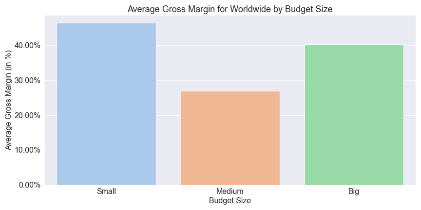
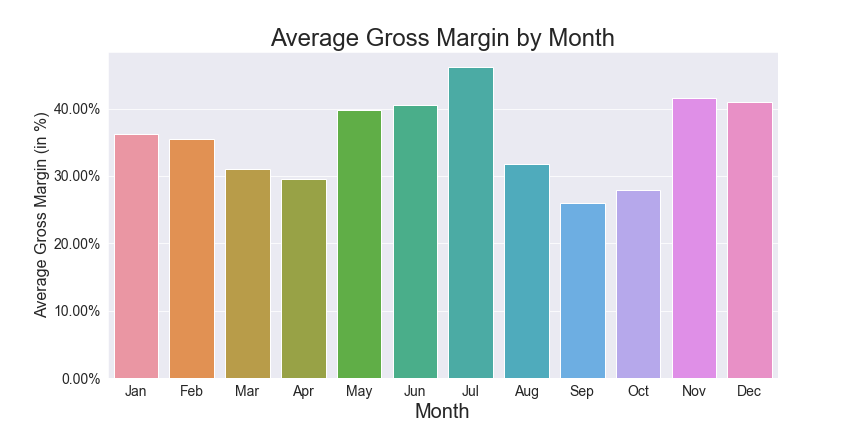
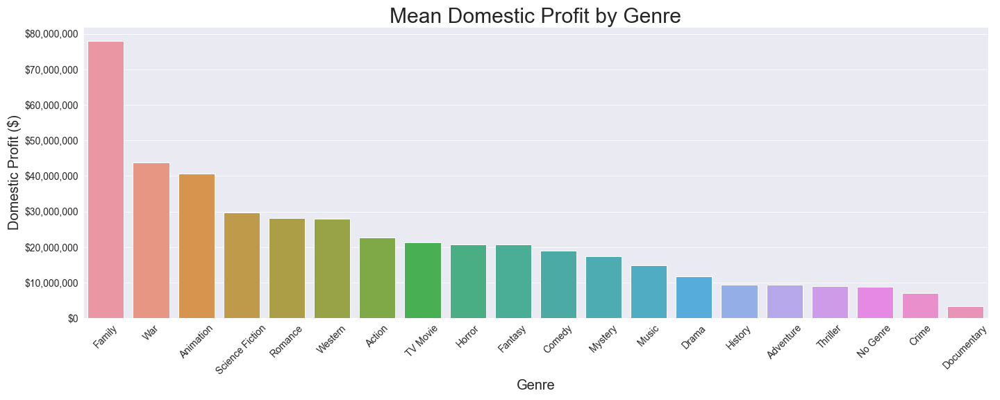

# Overview

Our group has been tasked with analyzing historical data from multiple sources regarding information about different movie productions. Our goal is to come up with three recommendations for the company Computing Vision in order to enter into the Movie Industry. Computing vision is a company that has seen the growth of companies creating video content and wanted to get in on the action however, they aren't sure of the best market entry strategy. We are going to define what success looks like in the movie indsutry but more specifically for this firm.

# Business Understanding

The key stakeholder is Computing Vision and their management team

The problem Computing Vision is faced with is that they want a piece of the movie market however don't know how to enter. We need to help them define what success means in this industry. With the data we have we want to explore whether financial metrics or fan (rating) metrics are a better indicator of success. We need to create actionable insights for Computing Vision to be able to decide what their entry strategy is going to be, and how to scale up once they are in the industry.

Key Business Questions: 
* What is success?
    * How much the movie grosses from “The Numbers”
    * The averaging rating / number of votes from IMDB database
    * Total Profit and Gross Margin based on budget size
* What do successful movies look like given our metrics
* How does genre impact the success of a movie (Based on Financial Metrics?
* Does director impact the rating and the net profitability?
* What time of the year (month) is best to release a movie?

While we may not touch on all of these, they are all things that could be consider as key questions for the firm. 

### What is Success?

We will define success in two ways. The first being the Gross Margin and the other being Total Profit. The Gross Margin calculations are detailed below. The reason we chose to focus on profitabilty metrics instead of ratings was because this company, computing vision, is trying to break into a well established market they want to ensure that the investment they put in is having a positive return. 

Our recommendations for this company will be based off of the Gross Margin which is portrayed as a percentage. The higher this percentage is the more the company is retaining for every dollar that is invested in the movie and as such is seeing a higher return on their investment. 

$Gross Margin = \frac{Gross Revenue - Production Budget}{Gross Revenue} x 100$

We want to investigate what a "Good Movie" i.e. a movie with a high Gross Margin is doing and try to emulate that. Thus we will explore the budget size, what directors are involved in those high margin films, and also what genres see the highest margin

# Data Understanding and Analysis

The data we chose to focus most of our efforts on came from:
* IMDB
* The Numbers
* TheMovieDB

Where most of our recommendations came from The Numbers which contains the Gross Revenue and Production Budget numbers as well as IMDB and TheMoviesDB which contained a lot of background information on the movies including ratings and genre. With more time we would like to explore what connections fan ratings have to the success of a movie as well as choice of director or actor.

With the information given we were able to explore connections between our definition of success, Gross Margin and Total Profit, and various features of the film industry such as budget size, genres, and what month to release in. 

## Data Visualizations

This visual shows us the average Gross Margin by budgets size in bar chart format. This also accompanies our primary hypothesis test between the difference of these means for the small and big budgets. It is interesting to see that you can put in less money budgeting yet gain a similar margin on your revenue and costs compared to a big budget film. The important distinction is that the scale of profit is drastically different

This visual shows how the mean gross margin changes by month. it is interesting to note that in the summer months the gross margin is noticeably higher than the beginning of the year. This coincides with school releases, the weather turning better, and more activity in peoples social lives. There is a slight lull towards the end of summer and into fall which coincides with school returning and people wanting to the last weeks of summer with friends. Then there is a spike for the holiday season when the weather is not as nice, and people are spending more time with families then they will be more inclined to see a movie. 

The family genre is noticeably the highest for domestic profit. After running some tests on the mean gross margin we decided this was not the best metric to determine genre as there were many that were not significantly different. When looking at small budget films we noted that domestically they tend to perform far better so looking at domestic profit confirms this, and for Family genre we would recommend creating this genre because it has the highest mean domestic profit.

# Statistical Communication

The question we wanted to answer was whether producing a big budget film (production budget > \\$50,000,000) or small budget film (production budget < \\$10,000,000) would be better for Computing Vision. Being a new company with little experience in the Movie Indstury and no name sake, going all in on a large budget film is risky. 

To test this, we calculated what the average Gross Margin ratio was for each of the budget sizes by creating a categorical variable to indicate the budget category. After some analysis we ran a independent two sample t test because we did not have all movies created in this test however we wanted to see whether their average gross margins were significantly different. 

The results of this are as follows:
    
$H_0:$ There is no difference between small and big budget mean worldwide gross profit margin 

$H_A:$ The mean Worldwide gross profit margins are different for small and big budget film
    
Results:
* p-value = 0.00456 < 0.05, < 0.10 thus at both a 90% and 95% confidence level we reject the null hypothesis
* This indicates that we have evidence to support the claim that the mean gross margin for small budget films is larger than big budget films

Recommendation and Findings: With the information provided, the means from the two samples are not significantly different, meaning based on the given samples the mean gross profit margin for small budget films is comparable to that of a big budget film.  However, for a company such as Computing Vision making their first break into the film industry, beginning with a low budget film that has the potential to turn a high percentage of gross revenue into profits can be a great start. They can then look to scale up and produce bigger budget films as they become a better known name in the industry and get their legs under them in production. 

# Conclusion

### Summary

Throughout our analysis we found many interesting items related to what makes a movie successful. For a company like Computing Vision, we believe the most relevant items will be financial success in the market as opposed to fan metrics such as average ratings. Because of this, we focused on Gross Margin and Total Profit to be indicators for our decisions. Through a series of data preparation, analysis, and visualization we were able to procure a set of three relevant recommendations for the firm to follow. 

### Relevant Findings
1. Produce a Small Budget Film
    * Small Budget Films have an average Gross Margin of 49.86% and Big Budgets is 53.13
    * These results are not significantly different based on our testing and as such we would recommend Small Budget
    * Small budget films have a higher probability of profit compared to big budget
        * Thus a better chance to see return on money spent producing a film
2. Create a movie in the Family genre
    * After some analysis we came to the conclusion that a drama movie would be the best movie to produce
        * Has the highest mean Domestic Profit
        * Matters because Small Budgets Films perform better domestically
    * Across the board in all level of analyses Foreign, Domestic, and Total Profit, Family topped the list
        * Family has the largest Gross Margin by a small amount compared to the Mystery Genre
        * The results comparing Family and mystery, and Family and TV Movie were not significant 
        * Then basing our recommendation off the Domestic Profit, we would still recommend a Family movie which has the highest domestic profit
3. Release your movie in May
    * We see that the summer months, which coincides to when school releases has a spike in average gross margin
        * To be most successful financially, May allows you to capture those months of high revnue
    * There is a dip in Aug, Sept, and Oct however dring the Holidays (Nov and Dec) there is another spike 
        * When releasing in May, you will capture both the summer and holiday high gross margins

